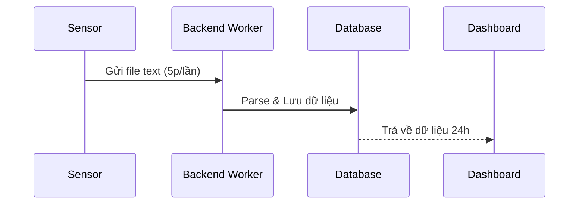
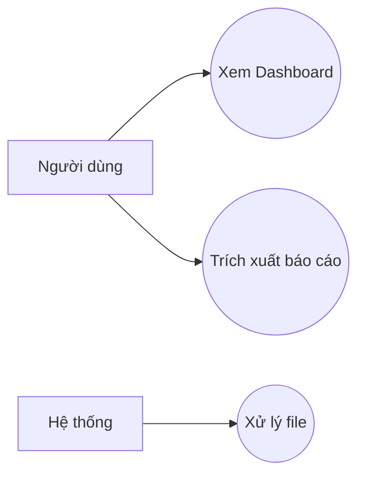

# 🛰️ IoT Sensor System - Công ty ABC

Hệ thống giám sát chất lượng môi trường (nước và không khí) dựa trên nền tảng IoT và Web Dashboard.

## 🚀 Tổng quan dự án
Dự án nhằm mục đích thu thập dữ liệu ô nhiễm từ các bộ cảm biến của công ty ABC, lưu trữ và hiển thị trực quan cho nhân viên vận hành và quản lý.

## 📂 Hồ sơ dự án (Documentation)
- [Bản đặc tả yêu cầu (BRD)](docs/specs/BRD.md)
- [Bộ câu hỏi khơi gợi (Questionnaire)](docs/requirements/questionnaire.md)
- [Thiết kế cơ sở dữ liệu](docs/architecture/Database_Schema.md)

## 📊 Kiến trúc & Luồng dữ liệu

### 1. Sơ đồ luồng (System Flow)

### 2. Sơ đồ ca sử dụng (Use Case)

## 🛠️ Công nghệ sử dụng (Tech Stack)
- **Backend:** Node.js, Express, TypeScript
- **Frontend:** React, Tailwind CSS, Chart.js
- **Database:** PostgreSQL / SQLite
- **Infrastructure:** SFTP Server for Data Storage

---
*Dự án được phát triển bởi Agent Orchestrator & Team.*