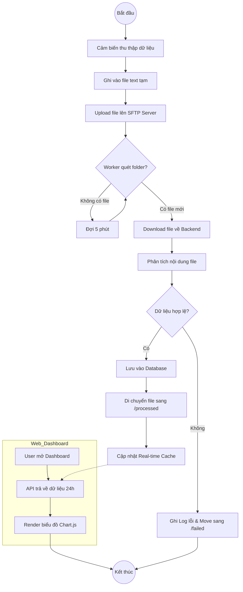

# Activity Diagram - Quy trình xử lý dữ liệu IoT

Sơ đồ này mô tả chi tiết các hoạt động (Activities) diễn ra trong hệ thống, từ khi cảm biến thu thập dữ liệu cho đến khi hiển thị lên Web Dashboard.

## 📊 Sơ đồ hoạt động (Activity Diagram)

## 🔍 Giải thích các bước quan trọng:
1.  **Vòng lặp (Wait 5 min):** Đảm bảo hệ thống không quét liên tục gây quá tải server (Polling mechanism).
2.  **Kiểm tra tính hợp lệ (Valid?):** Đây là bước quan trọng nhất của BA để đảm bảo dữ liệu "rác" không lọt vào database.
3.  **Phân vùng file (Failed/Processed):** Giúp quản trị viên dễ dàng theo dõi và xử lý lại các file bị lỗi.
