# BPMN Process Model - Quy trình giám sát môi trường

Sơ đồ BPMN (Business Process Model and Notation) cung cấp cái nhìn chi tiết và chuyên nghiệp nhất về quy trình phối hợp giữa con người, máy móc và công nghệ.

## 📊 Mô hình BPMN (Business Process Model)

```mermaid
graph TD
    subgraph POOL_ABC [Pool: Hệ thống Giám sát Công ty ABC]
        
        subgraph LANE_SENSOR [Lane: Thiết bị Cảm biến]
            StartEV(( )) -- Timer: mỗi 5p --> Collect[Thu thập dữ liệu]
            Collect --> Upload[Upload file sang SFTP]
        end

        subgraph LANE_SFTP [Lane: SFTP Server]
            Upload --> Store[Lưu file tạm]
        end

        subgraph LANE_BACKEND [Lane: Hệ thống Backend]
            Store -- Message: Có file --> Poll[Quét folder]
            Poll --> Download[Download file]
            Download --> Parse[Phân tích nội dung]
            Parse --> Gateway{Dữ liệu hợp lệ?}
            Gateway -- No --> LogErr[Ghi Log & End]
            Gateway -- Yes --> SaveDB[Lưu vào Database]
        end

        subgraph LANE_DATABASE [Lane: Cơ sở dữ liệu]
            SaveDB --> Persist[(Lưu trữ vĩnh viễn)]
        end

        subgraph LANE_USER [Lane: Người dùng/Quản lý]
            Persist -- Data Ready --> Request[Yêu cầu Dashboard]
            Request --> View[Xem biểu đồ & Báo cáo]
            View --> EndEV(( ))
        end
        
    end

    %% BPMN Symbols styling
    style StartEV fill:#9f9,stroke:#333
    style EndEV fill:#f99,stroke:#333
    style Gateway fill:#ff9,stroke:#333
    style Persist fill:#bbf,stroke:#333
```

## 🔍 Giải thích các thành phần BPMN:
1.  **Pool & Lanes:** Nhóm các bộ phận liên quan vào một "Hồ bơi" chung để thấy sự tương tác.
2.  **Timer Event (StartEV):** Quy trình bắt đầu tự động theo thời gian (định kỳ 5 phút).
3.  **Exclusive Gateway (Gateway):** Chỉ cho phép đi một hướng (Hợp lệ hoặc Không hợp lệ).
4.  **Message Flow:** Sự chuyển giao thông tin giữa các Lane (ví dụ: từ SFTP sang Backend).
