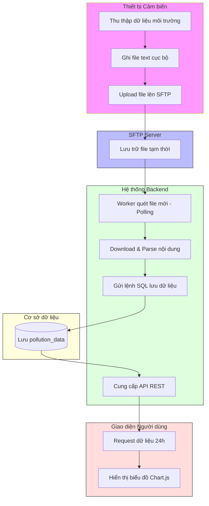

# Swimlane Diagram - Phân định trách nhiệm hệ thống

Sơ đồ làn bơi (Cross-functional Flowchart) giúp chúng ta thấy rõ bộ phận nào (Actor/System) chịu trách nhiệm cho các hoạt động cụ thể.

## 📊 Sơ đồ làn bơi (Swimlane Diagram)

## 🔍 Ý nghĩa của sơ đồ này:
1.  **Ranh giới (Boundaries):** Nhìn vào sơ đồ, chị sẽ thấy ngay việc upload file là việc của "Thiết bị", còn việc quét file là việc của "Backend".
2.  **Điểm tích hợp (Integration points):** Những mũi tên đi xuyên qua "vách ngăn" chính là nơi hai hệ thống tương tác với nhau (ví dụ: A3 sang B1).
3.  **Điểm chết (Deadlocks):** Nếu Backend không quét, dữ liệu sẽ kẹt ở "SFTP Server". Sơ đồ này giúp chúng ta không bỏ quên bất kỳ khâu nào.
