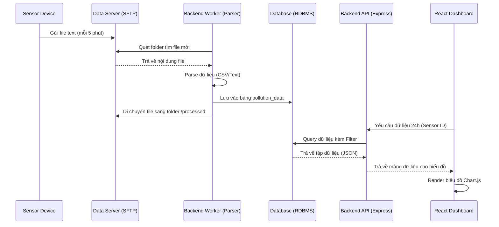

# System Architecture & Data Flow - IoT Sensor System

Hệ thống được thiết kế theo kiến trúc Micro-services đơn giản để đảm bảo tính module và dễ mở rộng.

## 🔄 1. Luồng dữ liệu (Data Flow Diagram)

## 🏗️ 2. Tầng Công nghệ đề xuất (Proposed Tech Stack)

-   **Backend (Core):** Node.js + TypeScript (để đảm bảo kiểu dữ liệu an toàn).
-   **File Scraper:** Node-cron + SSH2-SFTP-Client.
-   **Database:** PostgreSQL (Mạnh mẽ, hỗ trợ Time-series tốt thông qua TimescaleDB nếu cần).
-   **Frontend:** React + Vite + Tailwind CSS + Shadcn/UI.
-   **State Management:** TanStack Query (để xử lý Auto-refresh 5 phút mượt mà).

## 🛡️ 3. Bảo mật (Security)
-   **API:** Sử dụng JWT hoặc API Key để bảo vệ các Endpoint.
-   **Database:** Đặt trong mạng nội bộ (VPC), không public ra ngoài.
-   **SFTP:** Sử dụng Private/Public Key để kết nối lấy file.
